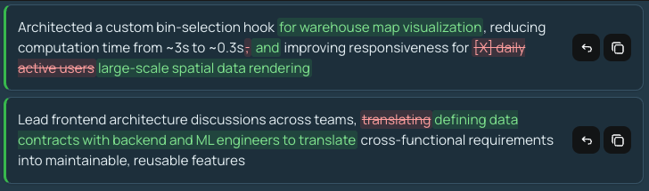
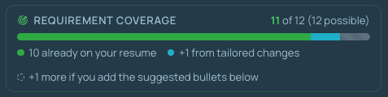
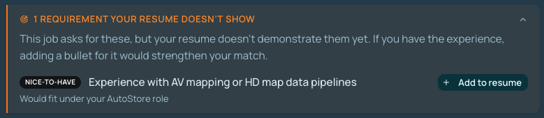
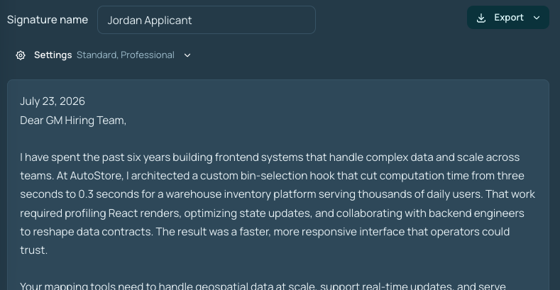

# Delta Resume

Tailor your resume to any job description in seconds, and walk away with a matching cover letter.

Upload or paste a base resume, drop in a job description, and Claude rewrites your bullets to fit the role. Every suggestion shows up as an inline word-level diff: accept or reject each change, then copy or export the result as DOCX or PDF (including format-preserving export from your original `.docx`).

**What you get**

- **Inline diff review:** Keep or revert every rewrite; unchanged lines stay collapsed so you focus on what changed
- **Cover letters:** Every tailor run also writes a matching cover letter; Pro lets you choose length and tone. Copy or export alongside the resume
- **Missing requirements (Pro):** See job requirements your resume doesn’t cover yet, plus one-click draft bullets you can insert and edit
- **Saved resumes:** Signed-in users auto-save after a run (1 on Free, 10 on Pro); rename or delete anytime
- **Try before you buy:** Guests get free credits with no account; preview an example tailor + cover letter without spending credits
- **Privacy-minded:** Tailoring runs aren’t stored; guest runs never touch the database; documents aren’t used for model training

## Screenshots



_Inline word-level diffs on resume bullets — accept or reject each rewrite_



_Requirement coverage meter showing matches, tailored gains, and remaining gaps_



_Missing requirements with one-click draft bullets to add to your resume_



_Matching cover letter generated with each tailor run — edit, then export_

## Structure

- `frontend/` - Vite + React + TypeScript + Mantine single-page UI
- `backend/DeltaResume.Api/` - F# + Giraffe + Dapper API with a DDD layering

## Running

### Backend

Requires .NET SDK and PostgreSQL. Listens on http://localhost:5100.

Create the local database once:

```bash
createdb deltaresume
```

**Environment variables** (in `backend/DeltaResume.Api/.env`; loaded automatically on `dotnet run` via DotNetEnv):

| Variable                  | Required | Description                                                                                                                                                                                                                                                                                                                                                                                                                          |
| ------------------------- | -------- | ------------------------------------------------------------------------------------------------------------------------------------------------------------------------------------------------------------------------------------------------------------------------------------------------------------------------------------------------------------------------------------------------------------------------------------ |
| `ANTHROPIC_API_KEY`       | Yes      | Anthropic API key for tailoring and cover letters                                                                                                                                                                                                                                                                                                                                                                                    |
| `CLERK_FRONTEND_API_URL`  | Yes      | Clerk Frontend API URL (e.g. `https://in-aphid-71.clerk.accounts.dev`). Found in the Clerk Dashboard under **API keys** → **Advanced** → **Frontend API URL**. If unset, all requests are treated as guests.                                                                                                                                                                                                                         |
| `CLERK_SECRET_KEY`        | Yes      | Clerk secret key (`sk_test_…` or `sk_live_…`) from the Clerk Dashboard **API keys**. Used to fetch `user.public_metadata` (e.g. lifetime-free Pro). If unset, lifetime-free entitlements are disabled.                                                                                                                                                                                                                               |
| `IP_HASH_SALT`            | Yes      | Secret key for HMAC-SHA256 hashing of guest IPs for credit tracking. Generate with `openssl rand -hex 32`.                                                                                                                                                                                                                                                                                                                           |
| `DATABASE_URL`            | No       | Postgres connection string or URI. Defaults to `Host=localhost;Database=deltaresume`. On Railway, reference the Postgres plugin’s `DATABASE_URL`.                                                                                                                                                                                                                                                                                    |
| `BACKEND_RUNNING_LOCALLY` | No       | Set to `true` when running the API on your machine (replaces `UNLIMITED_GUEST_CREDITS`, `DISABLE_RATE_LIMITING`, and `TRUST_FORWARDED_HEADERS=false`). When enabled: guest requests get unlimited tailor credits; API rate limiting is disabled; guest IPs are taken from the direct connection instead of `X-Forwarded-For`. Must be unset or `false` in production.                                                                |
| `TRUST_FORWARDED_HEADERS` | No       | Production only (ignored when `BACKEND_RUNNING_LOCALLY` is set). Set to `true` when running behind a reverse proxy so `X-Forwarded-For` / `X-Real-IP` are used for guest IP resolution. Non-public values (loopback, RFC1918, CGNAT) are skipped so a proxy hop cannot become a shared guest identity.                                                                                                                               |
| `CORS_ORIGINS`            | No       | Comma-separated allowed browser origins. Defaults to `http://localhost:5200`. In production, include your frontend URL (e.g. `https://app.example.com`).                                                                                                                                                                                                                                                                             |
| `SENTRY_DSN`              | No       | Sentry DSN for API error monitoring and tracing. Leave unset to disable.                                                                                                                                                                                                                                                                                                                                                             |
| `SOFFICE_PATH`            | No       | Path to the LibreOffice `soffice` binary used for server-side DOCX→PDF conversion (`POST /api/convert-pdf`). Defaults to `soffice` on `PATH`. On macOS: `brew install --cask libreoffice`, then set `/Applications/LibreOffice.app/Contents/MacOS/soffice`. If unavailable, the endpoint returns 503 and the frontend falls back to a lower-quality client-side (image-based) PDF. The production Docker image includes LibreOffice. |

```bash
cd backend/DeltaResume.Api
dotnet run
```

Tables are created automatically on startup (`CREATE TABLE IF NOT EXISTS`). Recreating the database is required for schema changes that alter existing column types.

### Backend on Railway

1. Set the service **Root Directory** to `backend/DeltaResume.Api` (uses the included `Dockerfile`).
2. Add a **PostgreSQL** plugin to the project.
3. On the API service, add a variable reference from Postgres → `DATABASE_URL`.
4. Also set: `ANTHROPIC_API_KEY`, `CLERK_FRONTEND_API_URL`, `CLERK_SECRET_KEY`, `IP_HASH_SALT`, `TRUST_FORWARDED_HEADERS=true`, `CORS_ORIGINS` = your deployed frontend origin(s). Optionally set `SENTRY_DSN`.
5. Do **not** set `BACKEND_RUNNING_LOCALLY`.

### Frontend

Proxies `/api` to the backend. Open http://localhost:5200 after starting.

**Environment variables** (in `frontend/.env.development.local`, gitignored; or `frontend/.env.development` for shared defaults):

| Variable                     | Required | Description                                                                                                                                  |
| ---------------------------- | -------- | -------------------------------------------------------------------------------------------------------------------------------------------- |
| `VITE_CLERK_PUBLISHABLE_KEY` | Yes      | Clerk publishable key (`pk_test_…` or `pk_live_…`)                                                                                           |
| `VITE_API_BASE_URL`          | No       | Backend URL when not using the Vite dev proxy. Leave unset for local dev; Vite proxies `/api` to `http://localhost:5100`.                    |
| `VITE_GA_MEASUREMENT_ID`     | No       | Google Analytics 4 measurement ID (`G-XXXXXXXXXX`). Used only in production builds; ignored in local/dev. When unset, analytics is disabled. |
| `VITE_SENTRY_DSN`            | No       | Sentry DSN for frontend error monitoring, tracing, and error-triggered session replay. Leave unset to disable.                               |

Pull Clerk keys from the linked **Delta Resume** application, then start the dev server:

```bash
cd frontend
clerk env pull --file .env.development.local
npm install
npm run dev
```

## Auth, credits, and billing

Authentication and billing are handled by [Clerk](https://clerk.com) (Clerk Billing uses Stripe under the hood). Credit enforcement is server-side:

- Guests get 3 lifetime credits, tracked against both a browser fingerprint (FingerprintJS, sent as `X-Guest-Fingerprint`) and a salted hash of their IP; the higher of the two usage counts applies, so clearing one alone does not reset credits.
- Free accounts get 3 lifetime credits shared across their Clerk user id and browser fingerprint (IP is not included); remaining is `limit - max(usage)` across those keys, so guest fingerprint usage carries over after sign-in. Free accounts can save 1 resume.
- Pro subscribers ($19/month, or $14/month billed annually) get 100 credits per calendar month, cover letter length and tone, full missing-requirements analysis with one-click draft bullets, and up to 10 saved resumes. The Pro badge tooltip shows the next billing reset date from Clerk’s frontend subscription data.
- One credit is spent when a valid tailoring request is accepted for AI processing, and refunded if the AI call fails or the request is cancelled before completing. Cover letters do not cost an extra credit. When credits run out the API returns `402 credits_exhausted` and the UI opens a paywall: sign-up (Google prominent) for guests, the Clerk `PricingTable` in-app checkout for signed-in users.
